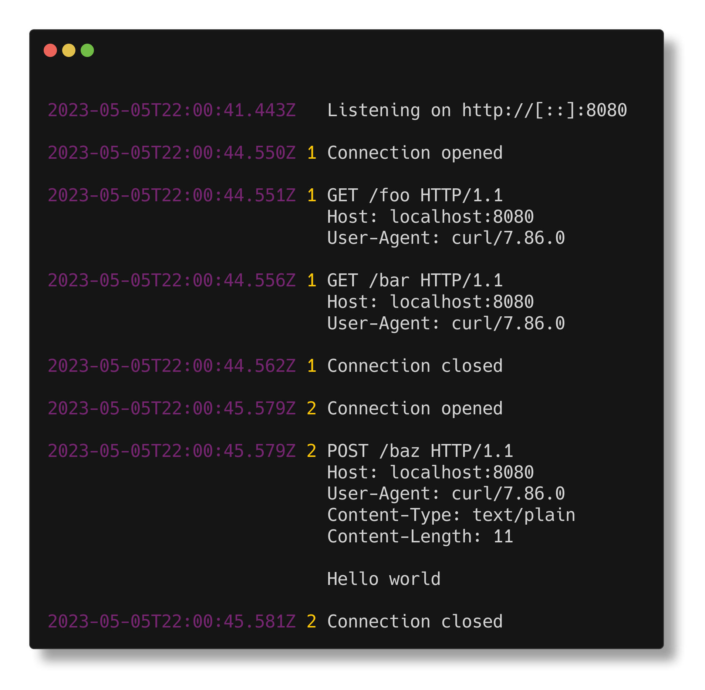

# `log-server`

A Node.js HTTP, HTTPS, or TCP server that:

- logs incoming connections and requests in a readable way
- allows response behaviour to be customized per request (see below)



The second column is a counter of TCP connections, making it easier to reason about which data came
in over which connection.

## Install

```sh
npm ci
```

### Enable HTTPS support

1. [Install mkcert](https://github.com/FiloSottile/mkcert?tab=readme-ov-file#installation)

1. Create local CA:

   ```sh
   mkcert -install
   ```

1. Create a certificate:

   ```sh
   cd certs
   mkcert localhost 127.0.0.1
   ```

## Run

```sh
npm start -- [http|https|tcp] [port]
```

- Mode defaults to `http`
- Port defaults to 8080 in `http` mode, 8443 in `https` mode, or 4444 in `tcp` mode

## Customizing response behaviour

### `http` and `https` modes

| Request query parameter     | Response behaviour                                                                                                               |
| --------------------------- | -------------------------------------------------------------------------------------------------------------------------------- |
| `?status={code}`            | Set response status code                                                                                                         |
| `?header={name}:{value}`    | Add response header. Can be specified multiple times to add multiple headers.                                                    |
| `?delay-headers={duration}` | Delay (in milliseconds) before sending response headers                                                                          |
| `?delay-body={duration}`    | Delay (in milliseconds) before sending response body                                                                             |
| `?body={message}`           | Set response body                                                                                                                |
| `?echo`                     | Send response body equal to request body, chunkwise<br>_Note: `delay-headers` and `delay-body` are ignored when this is enabled_ |

Also supports compressed responses (`br`, `gzip`, `deflate`) according to `Accept-Encoding` request
header.

e.g.

```sh
$ curl -i "http://localhost:8080/?delay-headers=2000&delay-body=1000&status=503&body=Oh%20no!"
```

### `tcp` mode

Each newline-separated command will be queued and executed in order:

| Command           | Behaviour                                                        |
| ----------------- | ---------------------------------------------------------------- |
| `sleep :duration` | Sleep for :duration milliseconds before running the next command |
| `print :message`  | Send :message back to the client                                 |
| `fin`             | Close the connection                                             |
| `rst`             | Forcibly reset the connection                                    |

e.g.

```sh
$ printf "print hello\nsleep 2000\nprint  world\nsleep 1000\nfin" | nc localhost 4444
```

## Development

Run and restart when files change:

```sh
npm run start:watch
```

Check types:

```sh
npm run check
```

Build to `dist/`:

```sh
npm run build
```

### Testing

Enable HTTPS server tests:

```sh
export NODE_EXTRA_CA_CERTS="$(mkcert -CAROOT)/rootCA.pem"
```

Run tests:

```sh
npm test
```

Run tests and watch for changes:

```sh
npm run test:watch
```

Run tests, generate coverage report, and exit with non-zero status if coverage is below 100%:

```sh
npm run test:coverage
```
